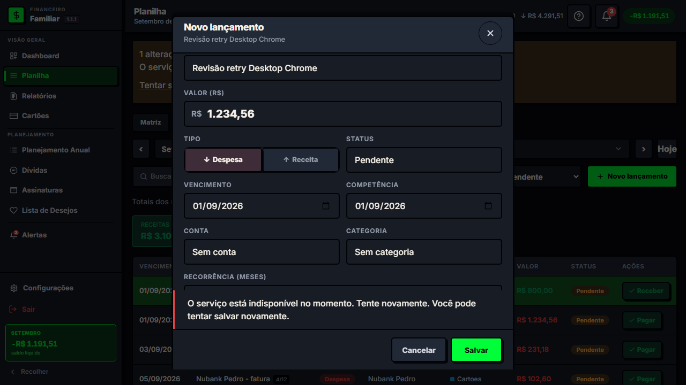
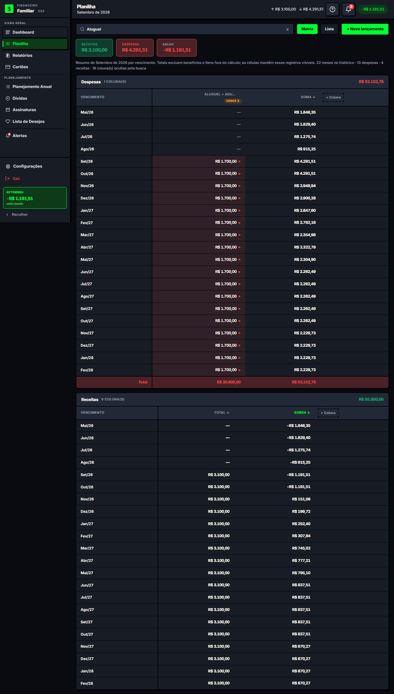
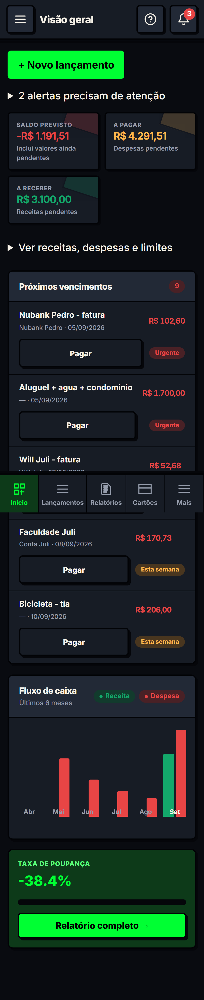
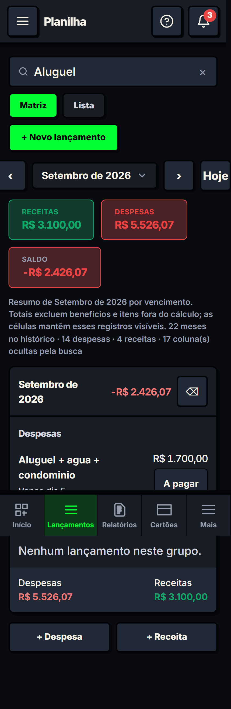
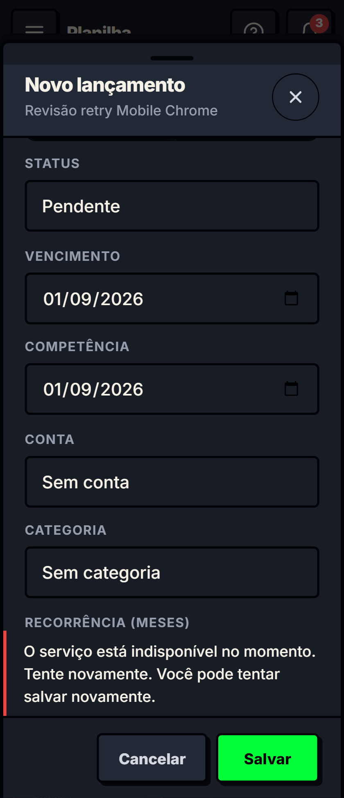
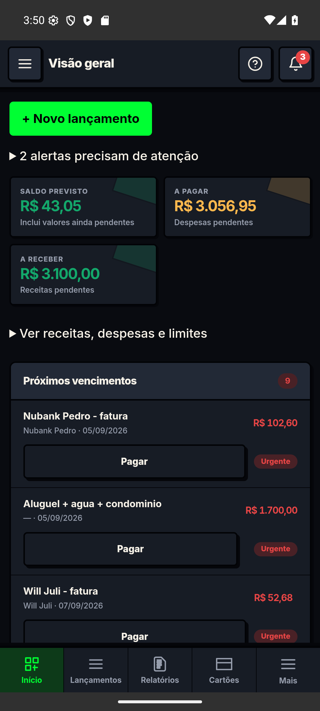
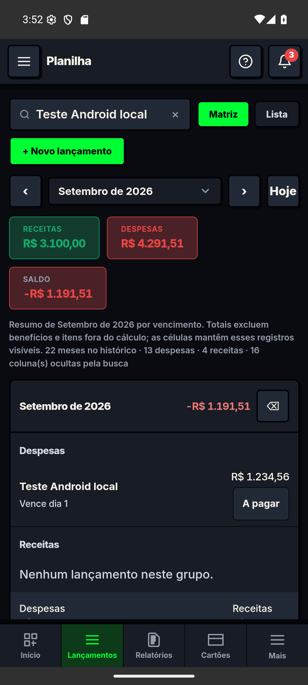
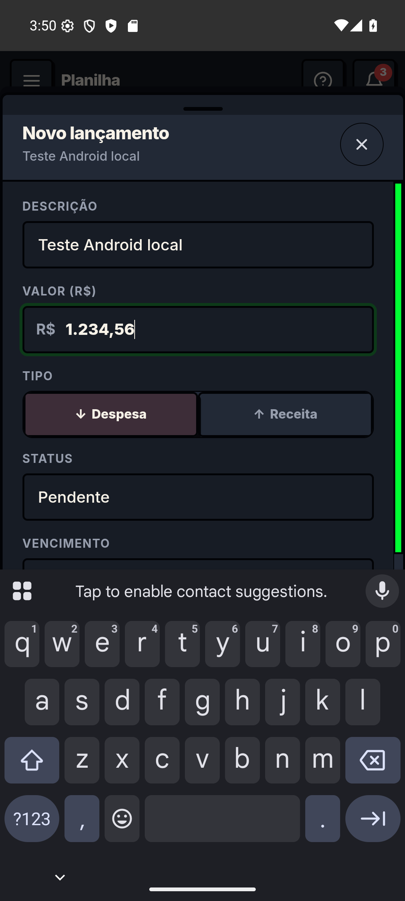
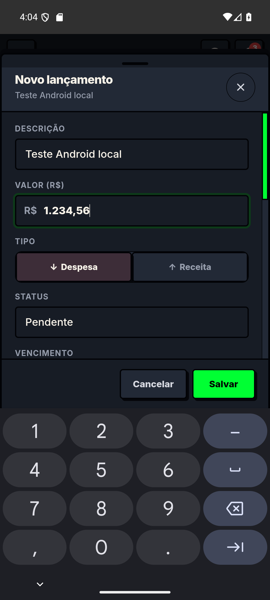

# Relatório consolidado de ajustes — web e mobile

**Projeto:** Financeiro Familiar · **Data:** 04/09/2026 
**Branch:** `codex/revisao-completa-web-mobile` · **Base:** `19b1c17`

Este relatório reúne as mudanças implementadas nesta revisão, com resumo de cada ajuste e capturas das telas exercitadas. As validações foram executadas nas etapas anteriores e consolidadas aqui; não foram repetidas para gerar este documento. A revisão tem pendências explícitas ao final. O código foi posteriormente publicado em homologação, usando o banco de produção por decisão do usuário; o web de produção permanece inalterado. Veja [11 — Entrega homol](11-homologacao-publicada.md). A migração do banco já foi aplicada e testada separadamente.

## 1. Ajustes de usabilidade e funcionamento

As referências W, M e A apontam para as capturas da seção 4. A imagem mostra o estado visual; comportamentos como persistência, foco e recuperação após erro são comprovados pelos testes descritos na seção 5.

| ID | Ajuste | Resumo do resultado | Evidência |
|---|---|---|---|
| U01 | Planilha mensal no celular | Substituída a sequência de 22 meses por um mês selecionado, com anterior/próximo/Hoje. | M2, A2; E2E |
| U02 | Contexto de navegação | Tela, mês, modo e busca ficam na URL; recarga e histórico preservam o contexto exercitado. | W2, M2; E2E |
| U03 | Cards mobile | Ações explícitas de editar e marcar status, com áreas de toque maiores e títulos legíveis. | M2, A2; Axe |
| U04 | Cabeçalho estreito | Título completo; informação secundária reduzida no celular e controles identificados. | M2; E2E em 320 px |
| U05 | Dashboard mais simples | Saldo previsto, a pagar e a receber em destaque; demais indicadores em detalhes expansíveis. | M1 |
| U06 | Ações do Dashboard | Novo lançamento acessível; ação Pagar nos vencimentos; alertas recolhíveis e vencimentos antes do gráfico no mobile. | M1 |
| U07 | Cadastro contextual | Novo lançamento usa o mês selecionado e apresenta título correto, sem ação de excluir um registro ainda novo. | W1, M3 |
| U08 | Valores brasileiros | `1.234,56` é interpretado como 1234.56; valores inválidos são rejeitados. | W1, A4; unitários e gravação Android |
| U09 | Validação do editor | Campos identificados, erro associado ao campo e foco no primeiro erro; datas e parcelas verificadas. | W1, M3; E2E |
| U10 | Recorrência confiável | Quantidade inteira de 1 a 120 meses; datas ajustadas ao fim do mês; IDs reutilizados nas novas tentativas. | Unitários e E2E; sem efeito visual específico |
| U11 | Proteção de rascunho | Confirmação antes de descartar; formulário mantém dados após erro e durante atualização do mesmo registro. | W1, M3; unitários e E2E |
| U12 | Mensagens de erro | Falhas de sessão, permissão e servidor recebem mensagens compreensíveis; tentativa de salvar disponível no diálogo. | W1, M3 |
| U13 | Editor em 320 px | Campos empilhados até 480 px; fonte de formulário 16 px; fechamento com alvo de 44 px; sem corte interno das datas. | M3; teste de overflow interno |
| U14 | Teclado e foco web | Diálogos compartilham foco inicial, contenção de Tab, Escape, bloqueio do fundo e retorno do foco. | E2E; a captura não demonstra interação por teclado |
| U15 | Controles acessíveis | Labels/IDs, nomes em botões, estado ARIA e select básico nativo; ajustes de contraste no editor e nos cards. | W1, M2, M3; Axe nos recortes |
| U16 | Edição agregada segura | Célula com vários registros não pode sobrescrever apenas um deles e apagar os demais; orienta editar pela Lista. | Unitários/E2E; Matriz em W2 |
| U17 | Totais e filtros | Saldo exclui benefícios e itens marcados fora do cálculo; filtros não incluem registros sem vínculo e a Lista explica o escopo dos totais. | Testes de regressão; capturas não auditam os cálculos |
| U18 | Períodos e vencimentos | Relatórios respeitam competência/vencimento e limites do período; KPI considera vencimentos de hoje durante o dia. | Testes de regressão |
| U19 | Erro na lista de desejos | Erro de carregamento deixa de parecer lista vazia e oferece nova tentativa. | Inspeção de implementação; sem captura dedicada |
| U20 | Ações da Matriz | Erros apresentados nos diálogos; bloqueio de envios simultâneos e confirmação ao descartar alterações. | Implementação; cobertura parcial dos fluxos |
| U21 | Editor no Android | A WebView considera teclado, barras e recortes; Cancelar/Salvar permanecem acima do teclado. | A3 → A4; toque real via ADB |

## 2. Ajustes de segurança, dados e manutenção

Estas mudanças não têm representação visual fiel. Sua evidência é código, teste ou banco; um print de interface não comprovaria isolamento, atomicidade ou permissões.

| ID | Ajuste | Resumo do resultado | Validação/limite |
|---|---|---|---|
| T01 | Gravação transacional | Exclusão e atualização em lote acontecem juntas; falha provoca rollback. | PostgreSQL local e SQL remoto |
| T02 | Isolamento por família | IDs e referências de outra família são rejeitados nas quatro tabelas; RPC restrita ao servidor. | SQL remoto; chamada de usuário negada como esperado |
| T03 | Edição parcial | Campos omitidos preservam origem, regra e metadados existentes. | Testes local e remoto |
| T04 | Contratos de entrada | Schemas Zod validam datas, enums, números, comprimentos e lotes de até 1.000 itens. | Testes locais |
| T05 | Fila de lançamentos | Identidade por usuário/família; envio serial; remoção somente após confirmação; troca de sessão invalida respostas antigas. | Testes de fila |
| T06 | Recuperação de pendências | Falhas de storage expostas; dados corrompidos e fila antiga preservados; retry/descarte explícitos. | Testes e status global; não é sincronização offline completa |
| T07 | Convites | Verificação de usuário/e-mail/papel; aceite transacional e uso único; criação direta pelo cliente restringida. | SQL remoto; nenhum convite enviado por e-mail |
| T08 | Histórico paginado | Leitura por cursor até não haver resultados, evitando truncamento por limite da Data API. | Implementado; teste remoto de carga pendente |
| T09 | Transporte centralizado | Wishlist e compartilhamento usam store, URL-base e autenticação comuns. | Lint/typecheck; homologação remota integral pendente |
| T10 | Cache financeiro | APIs com `no-store`; service worker não guarda respostas financeiras e remove cache antigo. | Implementação; ensaio de PWA instalada pendente |
| T11 | Ciclo de vida | Limpeza de listeners/subscriptions e compartilhamento do bootstrap concorrente da mesma sessão. | Testes locais e revisão |
| T12 | Notificações | Data, hora e fuso explícitos; ordenação/reagendamento; permissão não solicitada automaticamente no boot. | Lógica local; entrega real não homologada |
| T13 | Operações de manutenção | CSV e reconstrução usam o serviço de lote; reseed remoto desativado. | Implementação e testes de lote |
| T14 | Migração remota | Nova migração aplicada e registrada sem reaplicar as antigas; testes temporários encerrados com rollback. | [Relatório 07](07-migracao-remota.md) |
| T15 | CI e ambiente | Pipeline com lint, tipagem, testes, build e E2E; Node 22 indicado em `.nvmrc`. | Gates locais; máquina continuou com Node 20 |

## 3. Arquitetura e redução dos arquivos

| ID | Ajuste | Resumo |
|---|---|---|
| R01 | Modelo e navegação mensal | `useMatrixModel`, `useMonthNavigation` e `useFinanceNavigation` separam cálculos e contexto de tela. |
| R02 | Draft do editor | `useEntryDraft` concentra rascunho, validação e recorrência com dependências explícitas. |
| R03 | Edição da Matriz | `useMatrixEditing` preserva valor após falha e recebe a ação de persistência. |
| R04 | Ordem de colunas | `useMatrixColumnOrder` mantém preferência por família e tolera falhas de storage. |
| R05 | Componentes menores | `MatrixMonthCard`, `FinanceTopbar` e `HouseholdSettings` separam apresentação e responsabilidades. |
| R06 | Estado e infraestrutura | Tema/fila extraídos do store; mapeamento do banco e serviço de lotes separados do repositório. |
| R07 | Estilos e domínio | Estilos extensos em arquivos próprios; dinheiro, períodos e notificações em funções puras de `shared`. |
| R08 | Carregamento das telas | Imports assíncronos evitam carregar todas as telas antecipadamente; não eliminam o peso de módulos abertos. |

| Arquivo | Antes | Depois | Redução de linhas |
|---|---:|---:|---:|
| MatrizScreen.vue | 1.897 | 834 | 1.063 |
| FinanceEntryEditorModal.vue | 723 | 272 | 451 |
| FinanceSettingsPanel.vue | 1.451 | 519 | 932 |
| default.vue | 764 | 718 | 46 |
| useFinanceStore.ts | 577 | 505 | 72 |

Fonte: [contagem registrada](evidencias/arquivos-etapas234.json). São linhas físicas, incluindo vazias. A extração reduz a concentração de responsabilidades; não significa redução equivalente do código total ou do download. Tabela desktop, diálogos da Matriz e adapters do repositório ainda podem ser separados.

## 4. Prints web e mobile

Capturas de execução, com dados de demonstração. As imagens web foram registradas na etapa 02–04; as Android, durante a validação do APK. Mobile web é Chromium com viewport reduzido; Android é a WebView do APK no emulador API 36. Não são testes em aparelho físico. Nenhuma captura é apresentada como prova de comportamento que ela não mostra.

### W1 — Web desktop: editor após falha simulada

Mostra o valor brasileiro preservado e a mensagem de erro com possibilidade de nova tentativa. O erro HTTP 500 foi provocado pelo teste para validar recuperação (U07–U12, U15).

### W2 — Web desktop: Planilha com busca

Mostra a visão desktop da Matriz filtrada. Os testes verificaram preservação do contexto na navegação (U02 e U16).

### M1 — Mobile web: Dashboard

Indicadores essenciais, ação de novo lançamento e resumo de alertas (U05–U06). Captura de página inteira; barras fixas refletem o viewport usado na captura.

### M2 — Mobile web: Planilha em 320 px

Um mês, busca e card de lançamento, com cabeçalho legível (U01–U04).

### M3 — Mobile web: editor em 320 px

Campos empilhados e ações de recuperação após falha simulada (U07–U13). O corpo do formulário é rolável; a captura mostra a posição de rolagem do teste.

### A1 — APK Android: Dashboard

Aplicativo instalado no emulador, com barras do Android e navegação inferior.

### A2 — APK Android: Planilha

Busca e card mensal no Android, após gravação de um lançamento local (U01–U03, U08).

### A3 — Android antes: teclado encobrindo as ações

Defeito reproduzido: os botões do editor ficavam sob o teclado (U21).

### A4 — Android depois: ações acima do teclado

Correção com insets: Cancelar e Salvar permanecem visíveis, inclusive com teclado numérico. O toque ADB em Salvar gravou um único registro no valor correto (U21).

## 5. Validações consolidadas

| Validação | Resultado | Alcance |
|---|---|---|
| Lint e typecheck | Passaram | Código web na etapa 02–04 |
| Vitest | 39 testes / 9 arquivos passaram | Domínio, rascunho, fila e PostgreSQL local |
| E2E completo | 13 passaram / 8 skips por viewport | Web desktop/mobile; não inclui os testes ADB |
| Novos cenários de UX | 6 execuções aprovadas na última repetição | Parte dos 13 E2E, não são seis testes adicionais |
| Axe | Sem violações nos recortes exercitados | Topbar, editor e card; não certifica todas as telas |
| Build web e Storybook | Passaram | Saídas isoladas; avisos de chunks grandes persistem |
| Supabase remoto | Migração e verificações SQL/auth passaram | Novo backend local contra remoto ainda não homologado integralmente |
| APK com insets | Build passou e instalação concluída | Android API 36, backend local em memória |
| Teclado Android | Dois ciclos passaram | WebView 838 → 570 → 838 CSS px; sem overflow interno |
| Salvar com teclado aberto | Toque ADB passou | Um registro de 1234.56; editor fechou e altura foi restaurada |

Detalhes: [04 — validação](04-validacao-e-cobertura.md), [07 — Supabase](07-migracao-remota.md), [08 — Android](08-emulador-android.md) e [JSON da validação do teclado](evidencias/android-insets-resultados.json).

O emulador foi configurado com WHPX/RTX 3090, quatro núcleos e 4 GB de RAM. O snapshot apresentou instabilidade; a execução validada utilizou inicialização completa (~29 s), mantida como padrão. O bloqueio automático anterior de recompilação foi superado na nova tentativa autorizada; a correção de teclado está validada no API 36.

## 6. Pendências e recomendações

| Prioridade | Pendência | Próxima ação |
|---|---|---|
| Alta | 25 avisos npm, incluindo 3 críticos | Resolver a atualização da árvore em ambiente Node/npm compatível e repetir os gates. Tentativas anteriores falharam por erro interno do npm; não foi usado `--force`. |
| Alta | Código ainda não publicado | Revisar o conjunto e planejar publicação; a migração isolada não ativa todas as mudanças de backend/frontend. |
| Alta | Histórico antigo de migrações e avisos do Advisor | Reconciliar antes do próximo `db push`; revisar privilégios das funções antigas e proteção de senhas vazadas. |
| Média | Homologação nativa incompleta | Aparelhos físicos, Androids anteriores, notificações, widgets, arquivos e autenticação remota no APK. Investigar separadamente o ANR visto na restauração. |
| Média | Acessibilidade ampliada | Safari/iOS, zoom 200%, leitores de tela e telas secundárias. |
| Média | Performance em histórico grande | Medir Web Vitals, volume PostgREST e paginação por período; reduzir módulos pesados com base em medição. |
| Média | Conflitos offline entre dispositivos | Definir versionamento de registros e resolução de conflitos; fila atual não equivale a colaboração offline completa. |
| Evolução | Arquivos ainda extensos | Separar tabela/diálogos da Matriz, sidebar e adapters com contratos claros. |

**Estado de entrega:** ajustes descritos implementados na branch, com o alcance de validação indicado acima; capturas incorporadas; publicação posterior somente no projeto homol (documento 11). As pendências impedem considerar o projeto integralmente homologado para todos os dispositivos e cenários.
