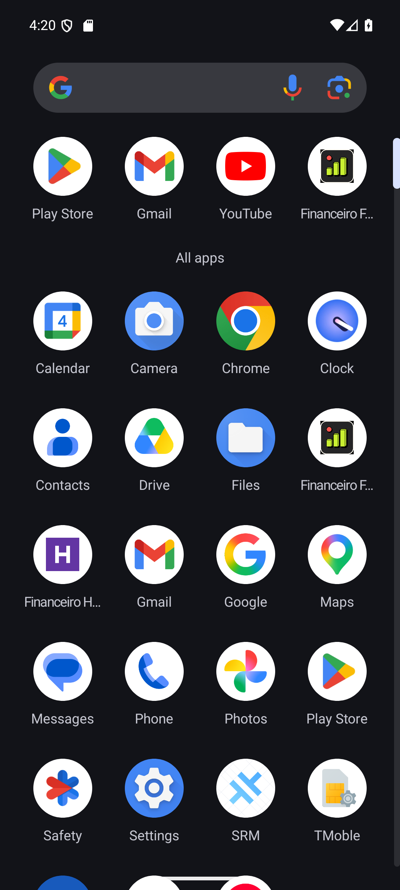

# Produção e homologação lado a lado

> **Atualização:** o usuário autorizou o banco de produção compartilhado. Web homol e APK foram publicados; veja [11 — Links e validação](11-homologacao-publicada.md). As pendências de provisionamento abaixo descrevem a preparação anterior.

## Estado da preparação

A separação Android foi implementada e validada no emulador. O projeto Vercel **planilha-homol** foi criado na conta `pedrovictorpinas-projects`, configurado com Nuxt e Node 22. Ainda não há deploy, URL de homologação publicada ou banco de homologação provisionado. O vínculo `.vercel/project.json` de produção não foi substituído.

| Item | Produção | Homologação |
|---|---|---|
| Application ID | `com.pedro.financeirofamiliar` | `com.pedro.financeirofamiliar.homol` |
| Nome | Financeiro Familiar | Financeiro Homol |
| Ícone | Atual | Roxo com H |
| APK | Canal atual | Build type `homol`, versão com sufixo `-homol` |
| WebView | URL de produção configurada | `ANDROID_HOMOL_URL`, HTTPS obrigatório |
| Web | Projeto Vercel `planilha` | Projeto Vercel `planilha-homol` |
| Banco/Auth | Supabase `planilha` | Projeto separado ainda necessário |
| Widgets/arquivos | Identificadores atuais | Action, provider e armazenamento separados pelo pacote |
| Atualizador APK | Release atual | Consulta ao canal de produção desabilitada |

Projeto Vercel homol: `prj_hf8L16q5M1WD2XdudwHSIfKDGTlL`. Produção permanece `prj_5XXvU8X6mjZqGefBBnWMER5qk855`. URLs reais de deploy devem ser obtidas da Vercel após publicar; não se presume a disponibilidade de um domínio pelo nome do projeto.

## Implementação

- `android/app/build.gradle`: build `homol` herda debug, usa suffix `.homol` e recursos/assets próprios. `generateHomolConfig` cria um asset separado; nunca reescreve o asset de produção. URL inválida, HTTP, credenciais, caminho/query ou hosts de produção conhecidos fazem o build falhar.
- `android/app/src/homol`: nome, ícone e identificação dos widgets específicos.
- Actions dos widgets usam `BuildConfig.APPLICATION_ID`; autoridade do FileProvider já usa `${applicationId}`. Activities mantêm o namespace Java existente, com pacote de instalação diferente.
- `app/app.vue`: APK `.homol` não consulta nem sugere a atualização APK de produção.
- `shared/environment.ts` + `nuxt.config.ts`: `NUXT_PUBLIC_APP_ENV=homol` exige projeto Supabase separado e consistente entre backend/login, credenciais e origem web/API coerentes. Não inicia homol em memória nem com o Supabase de produção conhecido.
- Cabeçalho web identifica **Homologação** quando esse ambiente está configurado.
- `.env.homol.example`: modelo sem segredos. Valores reais devem ficar em arquivo ignorado/variáveis da Vercel, nunca no Git.

## Verificação executada

- **42 testes passaram em 10 arquivos**, incluindo recusa de banco/API/URL de produção na configuração homol.
- Typecheck passou; lint sem erros, com um warning de prop `id` em `BaseSelect.vue`.
- `assembleHomol` passou em 10 s.
- APK inspecionado com aapt e leitura do ZIP: ID `.homol`, label `Financeiro Homol`, versão `1.1.1-homol`, `cleartext: false`.
- Teste negativo: Gradle rejeitou `ANDROID_HOMOL_URL=https://planilha-cyan.vercel.app` com exit 1.
- Instalado no emulador **ao lado** de `com.pedro.financeirofamiliar`; ambos retornados por `pm list packages`. O pacote original conservou a versão 1.1.1 e a data de atualização anterior (16:03:45); homol teve instalação própria (16:19:53).

**Limite do artefato atual:** para testar empacotamento/coexistência foi usada a origem reservada e inexistente `https://homologacao.invalid`. Esse APK é um protótipo de validação, não o APK funcional para entregar ao celular. O pacote original no emulador também é de testes, com o ID de produção; não foi alterado o aplicativo instalado no telefone do usuário. A verificação não homologa login, dados ou navegação remota de homol.

## Configuração operacional após definir o banco

1. Provisionar um Supabase exclusivo (schema, Auth e Storage) com dados de teste; não copiar dados financeiros nem usuários de produção por padrão.
2. Revisar o histórico/schema para instalar em banco vazio: as migrações antigas têm prefixos duplicados e não devem ser reaplicadas cegamente. Validar permissões/RLS e nova RPC no banco homol.
3. Preencher na Vercel homol as variáveis de `.env.homol.example`, com `NUXT_PUBLIC_APP_ENV=homol`, URL definitiva e project ref exclusivo; segredos somente server-side.
4. Publicar apenas no projeto `planilha-homol` e obter URL HTTPS estável. Configurar redirects de Auth e criar uma conta de teste separada.
5. Definir `ANDROID_HOMOL_URL` com essa origem e executar `npm run android:homol` com JDK 21 e Android SDK configurados. Saída: `android/app/build/outputs/apk/homol/app-homol.apk`.
6. Repetir login, gravação, isolamento, teclado e coexistência; então entregar o APK funcional e o link.

Não executar deploy com o vínculo padrão desta pasta sem selecionar explicitamente o projeto homol: ele continua apontando para produção. O build homol herda assinatura debug; manter a mesma chave para atualizações no celular. Antes de automatizar distribuição em outra máquina/CI, configurar uma chave de homologação persistente e guardada como segredo. Os workflows de release de produção permanecem com os comandos atuais.

## Decisão pendente: banco isolado e custo

Foram encontrados dois projetos Supabase ativos: `planilha` e `workflow`, e nenhuma preview branch. O plano efetivo da organização não foi confirmado. O [Free permite dois projetos ativos](https://supabase.com/docs/guides/platform/billing-on-supabase); projetos adicionais em plano pago aumentam custo de compute. Por isso não foi criado recurso pago sem definir orçamento. Não foi pausado/reutilizado `workflow` nem usado o banco de produção para viabilizar o teste.

Precisamos definir um projeto Supabase exclusivo disponível ou autorizar o provisionamento e seu custo. Depois disso, faltam deploy web, URL estável, novo APK com URL real e teste integrado. A criação do projeto vazio na Vercel não significa que o ambiente esteja no ar.

Referências: [Android — variantes e IDs separados](https://developer.android.com/build/build-variants), [Supabase — ambientes isolados](https://supabase.com/docs/guides/deployment/branching).
