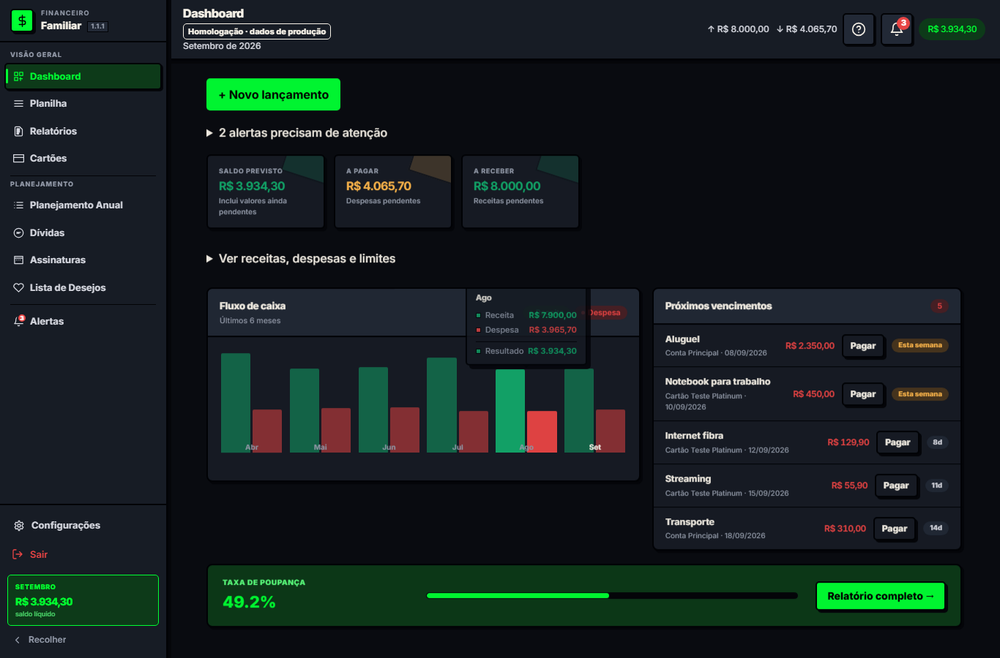
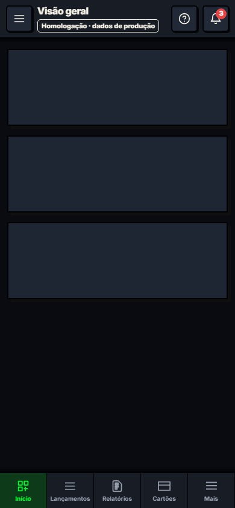

# Homologação publicada com banco compartilhado

## Acesso

- **Web:** https://planilha-homol.vercel.app
- **APK:** https://planilha-homol.vercel.app/downloads/Financeiro-Homol.apk
- **Aplicativo:** Financeiro Homol, ícone roxo H, pacote `com.pedro.financeirofamiliar.homol`, versão `1.1.1-homol`.
- **Banco e login:** mesmo projeto Supabase de produção, conforme autorização explícita do usuário em 04/09/2026.

**Alterações de dados em homol também afetam produção.** URLs, instalação Android, armazenamento local e versões do código são separados; dados financeiros e contas Supabase são compartilhados. Usar a conta de teste e sua família para ensaios. Nenhuma migração foi aplicada nesta etapa, nenhum projeto Supabase adicional foi criado e nenhum projeto existente foi pausado.

## Publicação realizada

Vercel: projeto exclusivo `planilha-homol` (`prj_hf8L16q5M1WD2XdudwHSIfKDGTlL`), Nuxt e Node 22. Deployment: `dpl_8hjwsXnN47ahM9kGVzQZZYKLkWhe`. Domínio confirmado pela API da Vercel e pelo deploy. O projeto web de produção e o vínculo `.vercel/project.json` do repositório foram preservados.

Publicação feita de uma pasta temporária contendo somente fontes necessárias e o APK em `public/downloads/Financeiro-Homol.apk`. Arquivos `.env`, credenciais, diretórios de agentes, relatórios locais e APK de produção não foram enviados. As credenciais do Supabase foram cadastradas como variáveis sensíveis do projeto Vercel homol; valores não constam deste relatório. Arquivos temporários usados na tentativa de cadastro foram removidos.

Configuração explícita:

```dotenv
NUXT_PUBLIC_APP_ENV=homol
HOMOL_WEB_URL=https://planilha-homol.vercel.app
HOMOL_SUPABASE_PROJECT_REF=whltzvaqakgvqfylciot
HOMOL_ALLOW_SHARED_PRODUCTION_DB=true
SUPABASE_URL=https://whltzvaqakgvqfylciot.supabase.co
NUXT_PUBLIC_SUPABASE_URL=https://whltzvaqakgvqfylciot.supabase.co
ANDROID_HOMOL_URL=https://planilha-homol.vercel.app
```

`SUPABASE_SERVICE_KEY` é privada no servidor; `NUXT_PUBLIC_SUPABASE_ANON_KEY` é a chave pública de cliente. A API é chamada na origem homol. O código recusa usar a origem web/API de produção como homol; o banco de produção só é aceito com a opção de compartilhamento explícita. Sem ela, o comportamento anterior de exigir banco separado permanece. O cabeçalho mostra **Homologação · dados de produção**. O APK homol não consulta o canal de atualização do APK de produção.

## Validação executada

| Verificação | Resultado |
|---|---|
| Unitários | 43 testes passaram em 10 arquivos |
| Typecheck | Passou |
| Build web Vercel | Passou, com avisos conhecidos de dependências/chunks |
| Login web com `teste@teste.com` | Passou |
| API sem sessão | HTTP 401 |
| Bootstrap autenticado | HTTP 200; 240 lançamentos da conta de teste; `private, no-store` |
| Novo backend homol → banco compartilhado | Gravou lançamento sintético de 0,01, pago e excluído dos cálculos; leitura confirmou persistência |
| Limpeza do teste | Registro sintético removido pela API; ausência confirmada por nova leitura |
| Mobile web 390×844 | Login, aviso homol e ausência de overflow horizontal confirmados |
| APK homol | Build passou; ZIP confirma ID `.homol`, URL HTTPS correta e `cleartext: false` |
| Download público APK | HTTP 200, 5.958.948 bytes; SHA-256 igual ao APK compilado |

SHA-256 do APK:

```text
4b9f132ca11ecdf4e9e1dba08dfad3f5076fb84a2fc288bb6a9cf1fa2001b3bc
```

Evidências: [teste web](evidencias/homol-web-validacao.json), [download](evidencias/homol-apk-download.json).

### Web desktop publicada



### Web mobile publicada



## Instalação no celular

Abrir o link do APK no Android, baixar e instalar. O nome e o pacote diferentes permitem manter **Financeiro Familiar** e **Financeiro Homol** juntos. A coexistência foi comprovada no emulador na etapa anterior, com [captura dos dois ícones](evidencias/android-prod-homol.png). Instalar o homol não substitui o pacote de produção. Fazer login com a conta habitual acessará os mesmos dados do banco compartilhado; para testes, preferir a conta de teste autorizada.

O APK usa a assinatura debug persistente desta máquina. Atualizações homol devem continuar usando essa chave; automatizar em outra máquina exige preservar a assinatura ou migrar conscientemente. Não é release de loja.

## Limites e manutenção

A revisão automática bloqueou o comando que reinstalaria/abriria o **APK final** no emulador, retornando apenas `blocked by policy`. Não foi contornado. Assim, a WebView final apontando ao site publicado ainda precisa ser exercitada no celular/emulador; não se afirma que esse último teste passou. A coexistência dos pacotes e a correção do teclado foram validadas anteriormente; o ZIP do APK final e seu download foram conferidos nesta etapa.

As vulnerabilidades de dependências e demais pendências do relatório 09 não foram resolvidas por este deploy. Recuperação de senha, confirmação de cadastro e OAuth não foram testados: redirects existentes do Supabase podem continuar apontando para produção. Não se mudou globalmente o Site URL do Supabase para não alterar esses fluxos de produção. O login por senha foi confirmado em homol.

Em futuros deploys, manter o APK em `public/downloads/Financeiro-Homol.apk` no pacote enviado, ou publicar uma nova URL e atualizar este documento; a pasta de staging atual é temporária. Atualizar primeiro o web homol e gerar novo APK apenas quando houver mudanças nativas/URL/versão. Para voltar a banco separado, trocar as credenciais/ref e desativar `HOMOL_ALLOW_SHARED_PRODUCTION_DB`; ensaiar migrações antes de usar um banco novo.
